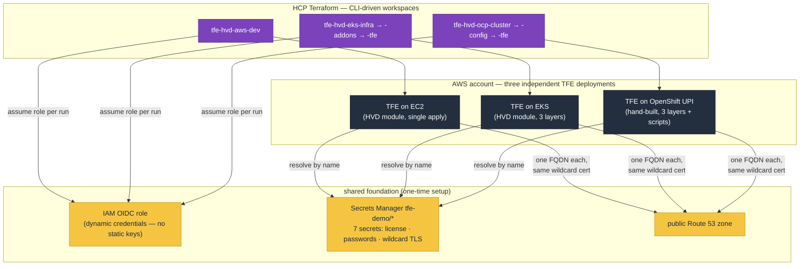

# terraform-enterprise-on-aws

Terraform configurations for deploying HashiCorp Terraform Enterprise (TFE) on AWS three ways — EC2 and EKS via the [HashiCorp Validated Design (HVD)](https://developer.hashicorp.com/validated-designs) modules, plus a hand-built OpenShift UPI install. Three independent deployments of the same product, side by side, in the same AWS account — used for learning and demos.

| Deployment | Directory | Module | HCP TF Workspace(s) |
|---|---|---|---|
| TFE on **EC2** | [`ec2/`](ec2/) | [terraform-enterprise-hvd/aws](https://registry.terraform.io/modules/hashicorp/terraform-enterprise-hvd/aws/latest) | `tfe-hvd-aws-dev` |
| TFE on **EKS** | [`eks/`](eks/) | [terraform-enterprise-eks-hvd/aws](https://registry.terraform.io/modules/hashicorp/terraform-enterprise-eks-hvd/aws/latest) | `tfe-hvd-eks-infra` → `-addons` → `-tfe` |
| TFE on **OpenShift (UPI)** | [`openshift/`](openshift/) | hand-built from the official [UPI templates](https://github.com/openshift/installer/tree/master/upi/aws/cloudformation) | `tfe-hvd-ocp-cluster` → `-config` → `-tfe` |

Every directory is a self-contained, CLI-driven root module with its own HCP Terraform workspace (all in the `jaz-hashi` org, Default Project) and its own state.



See the per-deployment READMEs:

- **[ec2/README.md](ec2/README.md)** — TFE on EC2 with RDS + ElastiCache; single apply.
- **[eks/README.md](eks/README.md)** — TFE on EKS in three layered workspaces (infra → addons → tfe), DNS via external-dns.
- **[openshift/README.md](openshift/README.md)** — TFE on a self-managed OpenShift cluster; `openshift/deploy.sh` runs the whole thing (`destroy.sh` reverses it).

---

## Repository layout

```
.
├── ec2/           # TFE on EC2 → workspace tfe-hvd-aws-dev (single apply)
├── eks/           # TFE on EKS — three layered workspaces, applied in order:
│   ├── infra/     #   1. tfe-hvd-eks-infra  (VPC, EKS, Aurora, Redis, S3, IRSA)
│   ├── addons/    #   2. tfe-hvd-eks-addons (AWS LB Controller, external-dns)
│   └── tfe/       #   3. tfe-hvd-eks-tfe    (k8s secrets, TFE Helm chart)
├── openshift/     # OpenShift 4 UPI on AWS + TFE (see openshift/README.md)
│   ├── cluster/   #   1. tfe-hvd-ocp-cluster (VPC, SGs, IAM, NLBs, DNS, RHCOS nodes)
│   ├── config/    #   2. tfe-hvd-ocp-config  (*.apps DNS post-install)
│   ├── tfe/       #   3. tfe-hvd-ocp-tfe    (RDS, Redis, S3, imds-proxy, TFE Helm chart)
│   └── scripts/   #   helpers called by deploy.sh / destroy.sh
└── scripts/       # shared: create_tfe_secrets.sh (Secrets Manager bootstrap)
```

The deployments use distinct `friendly_name_prefix` / `tfe_fqdn` values so they can coexist in the same account, each in its own VPC (EC2/EKS both use `172.31.0.0/16`, OpenShift uses `10.10.0.0/16` — separate VPCs, so no conflict, but same-CIDR VPCs can never be peered).

---

## Workspace variables

| Workspace | Terraform variables | Env variables |
|---|---|---|
| `tfe-hvd-aws-dev` | `friendly_name_prefix`, `tfe_fqdn`, `route53_tfe_hosted_zone_name` | `TFC_AWS_PROVIDER_AUTH`, `TFC_AWS_RUN_ROLE_ARN` |
| `tfe-hvd-eks-infra` | `friendly_name_prefix`, `tfe_fqdn`, `route53_tfe_hosted_zone_name` | `TFC_AWS_PROVIDER_AUTH`, `TFC_AWS_RUN_ROLE_ARN` |
| `tfe-hvd-eks-addons` | — (reads infra remote state) | `TFC_AWS_PROVIDER_AUTH`, `TFC_AWS_RUN_ROLE_ARN` |
| `tfe-hvd-eks-tfe` | — (reads infra remote state; `secret_prefix`/`tfe_image_tag` optional) | `TFC_AWS_PROVIDER_AUTH`, `TFC_AWS_RUN_ROLE_ARN` |
| `tfe-hvd-ocp-cluster` | — (bootstrap.sh generates cluster.auto.tfvars.json locally) | `TFC_AWS_PROVIDER_AUTH`, `TFC_AWS_RUN_ROLE_ARN` |
| `tfe-hvd-ocp-config` | — (reads cluster remote state; `apps_lb_hostname` set by post-install.sh) | `TFC_AWS_PROVIDER_AUTH`, `TFC_AWS_RUN_ROLE_ARN` |
| `tfe-hvd-ocp-tfe` | `cluster_*` auth vars (uploaded by set-cluster-auth.sh) | `TFC_AWS_PROVIDER_AUTH`, `TFC_AWS_RUN_ROLE_ARN` |

Secret ARNs are never workspace variables — configs resolve them by name from `secret_prefix` (default `tfe-demo`).

---

## Setting up from a fresh clone

Everything a new person needs, in order. Steps 1–6 are one-time platform
setup; after that each deployment is one command (or three applies).

### 1. What you need before starting

| Thing | Where to get it |
|---|---|
| AWS account + admin-ish local credentials | your cloud team (short-lived session keys are fine) |
| HCP Terraform organization | [app.terraform.io](https://app.terraform.io) — free tier works |
| TFE license (`.hclic`) | your HashiCorp account team |
| Public Route 53 hosted zone in the account | one zone serves all deployments — must be **delegated** (NS records at your registrar), not just created, or nothing will resolve |
| Red Hat pull secret (OpenShift only) | [console.redhat.com/openshift/install/pull-secret](https://console.redhat.com/openshift/install/pull-secret) |
| CLI tools | `terraform` (≥ 1.15), `aws` v2, `jq`, `curl`; docker/colima on macOS (OpenShift only) |

### 2. AWS OIDC role for HCP Terraform (one-time, outside this repo)

Every workspace authenticates to AWS via [dynamic credentials](https://developer.hashicorp.com/terraform/cloud-docs/workspaces/dynamic-provider-credentials) —
no static keys ever stored. With local AWS credentials, create (in a separate
bootstrap repo or by hand):

- An `aws_iam_openid_connect_provider` for `app.terraform.io`.
- An IAM role (e.g. `tfc-workload-identity-role`) whose trust policy allows
  that provider, scoped to your org/workspaces; give it broad infrastructure
  permissions **plus** `secretsmanager:DescribeSecret` and
  `secretsmanager:GetSecretValue` on `arn:...:secret:<secret_prefix>/*`.

<details>
<summary>Copy-paste Terraform for the provider + role (run locally with AWS creds)</summary>

```hcl
data "tls_certificate" "tfc" {
  url = "https://app.terraform.io"
}

resource "aws_iam_openid_connect_provider" "tfc" {
  url             = "https://app.terraform.io"
  client_id_list  = ["aws.workload.identity"]
  thumbprint_list = [data.tls_certificate.tfc.certificates[0].sha1_fingerprint]
}

resource "aws_iam_role" "tfc" {
  name = "tfc-workload-identity-role"

  assume_role_policy = jsonencode({
    Version = "2012-10-17"
    Statement = [{
      Effect    = "Allow"
      Principal = { Federated = aws_iam_openid_connect_provider.tfc.arn }
      Action    = "sts:AssumeRoleWithWebIdentity"
      Condition = {
        StringEquals = { "app.terraform.io:aud" = "aws.workload.identity" }
        # every workspace in your org may assume the role; tighten per-workspace if you prefer
        StringLike = { "app.terraform.io:sub" = "organization:<YOUR_ORG>:project:*:workspace:*:run_phase:*" }
      }
    }]
  })
}

resource "aws_iam_role_policy_attachment" "tfc_admin" {
  role       = aws_iam_role.tfc.name
  policy_arn = "arn:aws:iam::aws:policy/AdministratorAccess" # demo-grade; scope down for anything real
}
```

</details>

### 3. Point the code at your org

- Change `organization`/`name` in every `cloud {}` block (`ec2/provider.tf`, `eks/*/provider.tf`, `openshift/*/provider.tf`) and in the `terraform_remote_state` blocks (`eks/addons/data.tf`, `eks/tfe/data.tf`, `openshift/config/data.tf`, `openshift/tfe/data.tf`).
- Change the hardcoded region (`ap-southeast-1`) in each `provider.tf` if needed.
- `openshift/scripts/set-cluster-auth.sh` has `ORG`/`WORKSPACE` constants at the top — update those too.

### 4. Create the workspaces

In your HCP TF org: **Projects & workspaces → New workspace → CLI-Driven Workflow** (no VCS connection — the CLI uploads the config on every run). Create the ones you'll deploy, all in one project: `tfe-hvd-aws-dev`, `tfe-hvd-eks-{infra,addons,tfe}`, `tfe-hvd-ocp-{cluster,config,tfe}`. Then:

- On **every** workspace set the two env variables: `TFC_AWS_PROVIDER_AUTH=true`, `TFC_AWS_RUN_ROLE_ARN=<your role arn>` (a variable set applied to the project is the least tedious way).
- Set the Terraform variables per the table above (`ec2` and `eks-infra` need the fqdn/zone values; the rest have working defaults or are script-fed).
- Enable **remote state sharing** (workspace Settings → General): `tfe-hvd-eks-infra` → share with `-addons` + `-tfe`; `tfe-hvd-ocp-cluster` → share with `-config` + `-tfe`.

### 5. Authenticate locally

```sh
terraform login       # HCP Terraform token
# plus your AWS session keys in the shell (only the scripts need them —
# terraform runs use OIDC)
```

### 6. Create the shared TFE secrets (once)

```sh
export TFE_HOSTED_ZONE="your-zone.example.com"
export AWS_REGION="ap-southeast-1"
export SECRET_PREFIX="tfe-demo"
export TFE_LICENSE_PATH="/path/to/terraform.hclic"
./scripts/create_tfe_secrets.sh
```

Creates all seven secrets (license, passwords, wildcard TLS cert/key/CA) in
Secrets Manager — see [scripts/README.md](scripts/README.md). All deployments
share them and resolve them by name; no ARNs are ever copied around. **They
must exist before any deployment** — `openshift/deploy.sh`'s preflight checks
for them and aborts if missing.

### 7. Deploy

```sh
# TFE on EC2 — one apply
cd ec2 && terraform init && terraform apply

# TFE on EKS — three applies, in order
cd eks/infra  && terraform init && terraform apply
cd ../addons  && terraform init && terraform apply
cd ../tfe     && terraform init && terraform apply

# TFE on OpenShift — one command (see openshift/README.md for details)
cd openshift
export OCP_BASE_DOMAIN="your-zone.example.com" OCP_CLUSTER_NAME="tfe-ocp" \
       AWS_REGION="ap-southeast-1" PULL_SECRET_PATH="$HOME/Downloads/pull-secret.txt"
./deploy.sh
```

Teardown: `eks/tfe` → `eks/addons` → `eks/infra` (order matters — addons runs
the LB controller that cleans up TFE's load balancer), `ec2`, and
`openshift/destroy.sh`.

Costs to expect while running: ~3 NAT gateways + NLB + RDS + ElastiCache per deployment, plus an EKS control plane and 3 nodes on the EKS side, or 6 × m6i.xlarge on the OpenShift side — **destroy when not demoing**.
