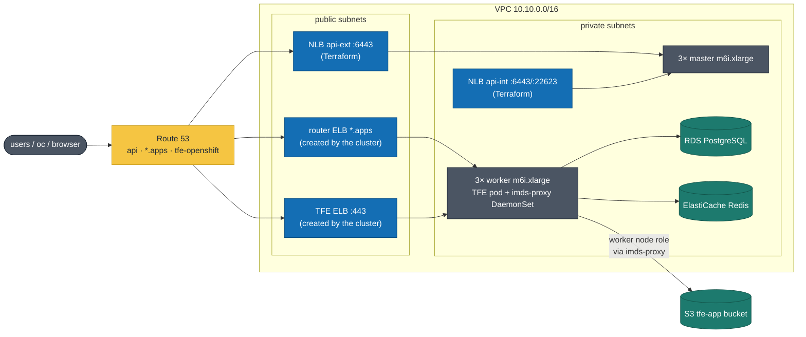
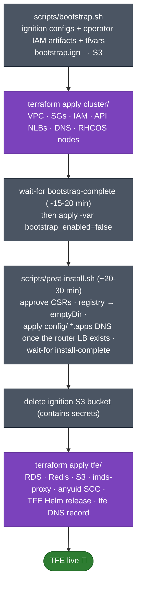

# OpenShift 4 (UPI) on AWS — for TFE

Full **user-provisioned infrastructure** OpenShift install on AWS EC2, as a learning-grade translation of the official [UPI CloudFormation templates](https://github.com/openshift/installer/tree/master/upi/aws/cloudformation) into Terraform, layered like the rest of this repo. TFE lands on top as layer 3 (built once the cluster exists).

| Layer | Directory | Workspace | Contents |
|---|---|---|---|
| 1. Cluster | [`cluster/`](cluster/) | `tfe-hvd-ocp-cluster` | VPC, SGs, IAM, API NLBs, DNS, RHCOS bootstrap/master/worker nodes |
| 2. Config | [`config/`](config/) | `tfe-hvd-ocp-config` | Post-install: `*.apps` wildcard DNS |
| 3. TFE | [`tfe/`](tfe/) | `tfe-hvd-ocp-tfe` | RDS/ElastiCache/S3 backing, imds-proxy, anyuid SCC grant, TFE Helm chart |

**Why three workspaces?** Each layer's inputs become known at a different
moment. `cluster` is everything knowable *before* the cluster boots (AMI,
ignition, subnets) — applied once, 130+ resources. `config` is the one thing
that depends on *runtime* cluster state: the `*.apps` records need the router
LB hostname, which the cluster itself creates mid-install — so it's a
2-resource layer Terraform can apply the moment that LB exists (playing the
role external-dns plays on EKS), re-appliable in seconds with zero blast
radius. `tfe` is the app. Same layering logic as `eks/`.

```
openshift/
├── deploy.sh / destroy.sh   # the two entry points
├── scripts/                 # helpers the entry points call (bootstrap, post-install, cluster auth)
├── templates/               # install-config.template.yaml
├── cluster/  config/  tfe/  # the three Terraform layers (one workspace each)
├── .bin/                    # openshift-install, oc, ccoctl — downloaded by bootstrap.sh (gitignored)
└── install-dir/             # installer working dir — SECRETS, per-cluster (gitignored)
```

**Cost warning:** ~7 × m6i.xlarge + NLBs + NAT ≈ **$600–800/month**. Destroy between sessions.

---

## How UPI works (the 30-second version)

`openshift-install` never touches AWS here. It turns `install-config.yaml` into **ignition configs** — first-boot instructions for RHCOS machines. Terraform provisions everything (network, LBs, DNS, instances) and hands each instance a tiny ignition *pointer*: masters/workers fetch their real config from the **Machine Config Server** (`api-int:22623`, served by the bootstrap node first, then the control plane); the bootstrap node pulls its full config from S3. The temporary **bootstrap node** brings up an initial control plane, the real masters join, then bootstrap is torn down. Worker nodes ask to join via **CSRs you must approve**.

What's running once everything is up:



Blue = load balancers (NLBs are Terraform's; the router/TFE ELBs are created
by the cluster itself — which is why destroy.sh sweeps them). Teal = data.

## Quick start

```sh
# One-time prereqs (deploy.sh preflight aborts early if any is missing):
#   aws login                  fresh session (local creds are only used by the scripts)
#   terraform login            HCP Terraform token
#   colima start               docker daemon (macOS only, for ccoctl)
#
# On a NEW account, the shared TFE secrets must exist BEFORE deploy.sh —
# run once, from the repo root (same 7 secrets ec2/ and eks/ use):
#   ./scripts/create_tfe_secrets.sh   (license, passwords, wildcard TLS — see scripts/README.md)

export OCP_BASE_DOMAIN="<your public Route53 zone>"
export OCP_CLUSTER_NAME="tfe-ocp"
export AWS_REGION="ap-southeast-1"
export PULL_SECRET_PATH="$HOME/Downloads/pull-secret.txt"   # console.redhat.com/openshift/install/pull-secret

cd openshift
./deploy.sh     # ~90 min -> live TFE
./destroy.sh    # the reverse, when done for the day
```

What deploy.sh does, end to end:



Gray = scripts/installer, purple = Terraform applies.

Both scripts are linear and readable — every stage is a plain terraform/oc/aws
command you could run yourself. The step-by-step version of the same flow:

## Runbook (what deploy.sh does)

```sh
cd openshift

# 1. Generate cloud credentials (STS roles via ccoctl), ignition + terraform inputs.
#    Needs local AWS creds AND a running docker daemon on macOS (colima start) —
#    ccoctl is Linux-only and runs in a container. credentialsMode is Manual:
#    per-operator IAM ROLES assumed from the node instance-profile roles via
#    IMDS (no IAM users, no long-lived keys). The usual OIDC/IRSA federation
#    is unavailable here — the sandbox SCP denies creating self-hosted IAM
#    OIDC providers — so cluster/identity.tf role-chains instead.
scripts/bootstrap.sh    # writes install-dir/ (gitignored!) + cluster/cluster.auto.tfvars.json,
                        # emits operator role/policy JSON, uploads bootstrap.ign to S3

# 2. Provision everything (~5-8 min)
terraform -chdir=cluster init && terraform -chdir=cluster apply

# 3. Wait for the temporary control plane handoff (~15-20 min)
.bin/openshift-install wait-for bootstrap-complete --dir install-dir

# 4. Remove the bootstrap node
terraform -chdir=cluster apply -var bootstrap_enabled=false

# 5. CSR approvals + registry storage + *.apps DNS + wait for install
#    (~20-30 min; prints console URL + kubeadmin password when done).
#    The *.apps records (config layer) are applied MID-install, as soon as
#    the router's LB exists — the authentication/console operators only go
#    Available once their routes resolve, and install-complete waits on them.
scripts/post-install.sh

# 6. Clean up the ignition bucket (contains secrets, no longer needed)
aws s3 rb "s3://$(jq -r .bootstrap_ign_bucket cluster/cluster.auto.tfvars.json)" --force

# 7. Deploy TFE (layer 3). Uses the same Secrets Manager secrets as ec2/ and
#    eks/ (scripts/create_tfe_secrets.sh at the repo root). set-cluster-auth.sh
#    uploads the cluster's system:admin cert to the workspace as sensitive
#    variables — re-run it whenever the cluster is rebuilt.
terraform -chdir=tfe init
scripts/set-cluster-auth.sh
terraform -chdir=tfe apply   # ~20 min: RDS is slow; first TFE boot runs migrations

# 8. Create the initial admin user (prints a one-time URL + token)
.bin/oc exec -it -n tfe deploy/terraform-enterprise -- \
  tfectl admin token --url "$(terraform -chdir=tfe output -raw tfe_url)"
```

Login: `oc login` / console with `kubeadmin` + `install-dir/auth/kubeadmin-password`.

## Drift & repair

`deploy.sh` is fresh-build-only (it aborts if `install-dir/` exists — ignition
is single-use, so the installer must never re-run against a live cluster).
Reconciling a drifted-but-alive environment is plain Terraform:

```sh
terraform -chdir=cluster apply        # AWS infra: VPC, SGs, IAM, NLBs, nodes, DNS
terraform -chdir=config apply -var apps_lb_hostname=<router LB hostname>
terraform -chdir=tfe apply            # RDS/Redis/S3, imds-proxy, TFE release
```

Each apply is idempotent — "no changes" when healthy, repairs what drifted
when not. In-cluster problems (degraded operators, pending CSRs) are the
cluster's own job: `oc get co`, and see the sharp edges below. If the install
artifacts themselves are gone or cluster identity is broken, that's a rebuild:
`destroy.sh` then `deploy.sh`.

## Teardown

`./destroy.sh` — destroys tfe → config → cluster in order, then removes the
local install artifacts. Two things it handles that plain `terraform destroy`
does not:

- **Cluster-created load balancers.** The in-cluster cloud controller creates
  the router (and TFE) load balancers outside Terraform; left alone they pin
  the subnets/IGW and the VPC teardown fails with `DependencyViolation`.
  destroy.sh deletes anything tagged `kubernetes.io/cluster/<infra_id>` first.
- **Destroy-safe layers.** Each layer plans its destroy even when its inputs
  are gone: `config`'s `apps_lb_hostname` and `tfe`'s cluster-auth variables
  have defaults, and remote-state lookups are wrapped in `try()` — so a
  UI-queued destroy or an out-of-order teardown errors on nothing.

Ignition is single-use per cluster: a rebuild always starts with a fresh
`scripts/bootstrap.sh` run, which `deploy.sh` does for you.

## Why no OIDC/IRSA (and what that means)

The canonical STS setup for self-managed OpenShift registers a self-hosted OIDC issuer (S3-hosted discovery doc + JWKS) as an IAM identity provider, and per-operator roles trust it — same idea as EKS IRSA. **The sandbox allowlists `iam:CreateOpenIDConnectProvider` to specific issuer URLs** (HCP, EKS, ROSA, `*.sbx.hashidemos.io`), and ccoctl's S3-hosted issuer isn't one of them, so that path is closed here. (A future improvement: hosting the issuer under the sandbox domain via CloudFront + ACM *is* allowlisted and would restore full IRSA — deliberately skipped to keep this stack simple.)

The fallback would be operators assuming their roles from the node instance profile via IMDS (`credential_source = Ec2InstanceMetadata`), but [pods on the pod network cannot reach IMDS on OpenShift](https://access.redhat.com/solutions/4498111) — OVN-Kubernetes makes link-local unreachable by design. So this install runs the **UPI-minimal-cloud pattern** instead:

- **Host-network components work normally** via the node instance roles: the cloud controller manager creates the API/router load balancers, kubelet/CSI node operations work.
- **Pod-network operators are configured to not need AWS**: Terraform owns DNS (`config/` layer, public + private `*.apps`) and machines (no machine-api manifests); the registry uses emptyDir instead of S3 (`post-install.sh`).
- The per-operator IAM roles from `identity.tf` still exist with IMDS-chained trust — usable by any future host-network workload.
- **TFE's own S3 access** (layer 3) goes through the `imds-proxy` DaemonSet ([`tfe/imds-proxy.tf`](tfe/imds-proxy.tf)): a host-network socat relay that re-exposes IMDS to the pod network, so TFE's AWS SDK picks up worker-node-role credentials (`AWS_EC2_METADATA_SERVICE_ENDPOINT`). Short-lived STS only — but any pod that can reach the Service gets node-role credentials, so the isolation is per-node, not per-pod.

No long-lived credentials anywhere in this design.

## Sharp edges to know

- **`install-dir/` is radioactive**: ignition embeds your pull secret and every cluster cert/key; `auth/` holds the admin kubeconfig. Gitignored, and kept outside the Terraform directories so HCP TF uploads can never include it. Certificates in ignition expire ~24h after generation: if you don't finish the install same-day, destroy and re-run `scripts/bootstrap.sh`.
- **Ignition is single-use.** One `bootstrap.sh` run = one cluster's identity. Never reuse `install-dir/` for a second cluster.
- **Workers stuck NotReady / missing** → CSRs pending approval. `scripts/post-install.sh` approves them continuously; if you skipped it: `oc get csr -o name | xargs oc adm certificate approve` (2-3x over a few minutes).
- **`cluster/cluster.auto.tfvars.json` lives locally**, so cluster applies must run from this machine (the CLI uploads it with the config). Fine for CLI-driven workspaces.
- Remote state sharing: enable on `tfe-hvd-ocp-cluster` for `tfe-hvd-ocp-config` and `tfe-hvd-ocp-tfe` — Settings → General.
